# 🚀 WPF Stopwatch & Timer Application


## 📋 Project Overview
Advanced WPF application featuring both stopwatch and countdown timer functionality with millisecond precision.

## 🏗️ Architecture Diagrams

### 1. Class Diagram


### 2. State Diagram


### 3. Timer state diagram

```mermaid

stateDiagram-v2
    [*] --> Idle: Initialization
    Idle --> Set: SetTimerButton_Click
    Set --> Running: StartTimerButton_Click
    Running --> Paused: StopTimerButton_Click
    Paused --> Running: StartTimerButton_Click
    Running --> Completed: Time's up.
    Completed --> Idle: OK в MessageBox
    Paused --> Idle: SetTimerButton_Click
```

### 4. Sequence of stopwatch operation


### 5. Sequence of operation of the countdown timer

```mermaid

sequenceDiagram
    participant User
    participant UI as MainWindow
    participant Timer as DispatcherTimer
    
    User->>UI: Sets the time (Set)
    UI->>UI: Input validation
    UI->>User: Displays the set time
    User->>UI: Presses Start
    UI->>Timer: Start()
    loop Every 10ms
        Таймер->>UI: Tick event
        UI->>UI: Check remaining time
        alt There's time left
            UI->>User: Update TimerDisplay
        else Time's up
            UI->>Timer: Stop()
            UI->>User: Show MessageBox
        end
    end
```

## 🛠️ Build Information

### Platform Support
| Platform | Configurations           |
|----------|--------------------------|
| Windows  | Debug / Mixed / Release  |

### How to Build
1. **Prerequisites**:
   - Install [Visual Studio 2022](https://visualstudio.microsoft.com/)
   - Select ".NET Desktop Development" workload
   - Include "C# WPF" components

2. **Build Steps**:
   ```bash
   git clone https://github.com/your-repo/wpf-timer.git
   cd wpf-timer
   msbuild Stopwatch.sln /p:Configuration=Release
   ```

3. **Run Application**:
   ```bash
   .\bin\Release\net7.0-windows\Stopwatch.exe
   ```

## 👨‍💻 Developers
- [Dance Maniac](https://github.com/dancemaniac)
- [Kirill910000](https://github.com/kirill910000)
- [Artem](https://github.com/Stinnnaler)

## 📜 License
MIT License. See [LICENSE](LICENSE) for full details.

> **Note**: All diagrams use standard Mermaid.js syntax supported by GitHub.
> For local preview, use [VSCode with Mermaid plugin](https://marketplace.visualstudio.com/items?itemName=bierner.markdown-mermaid).
